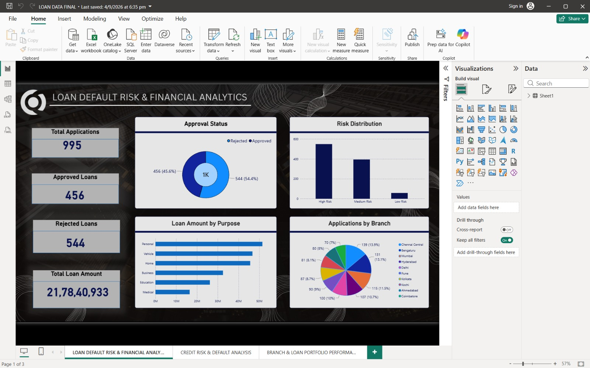
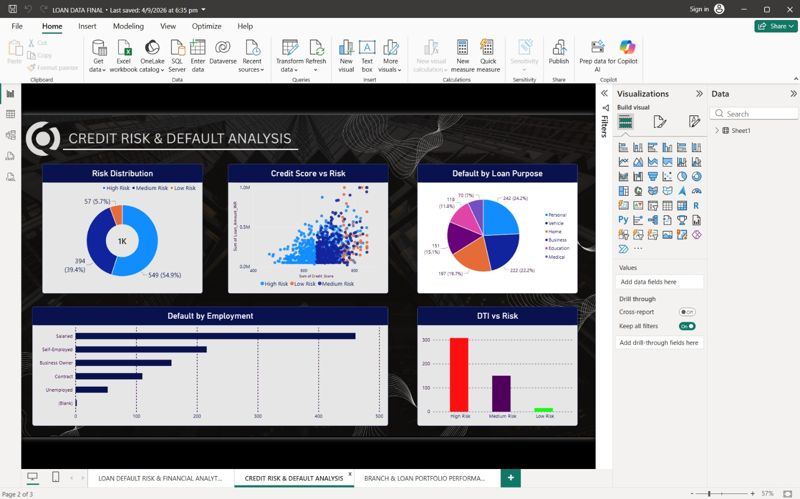
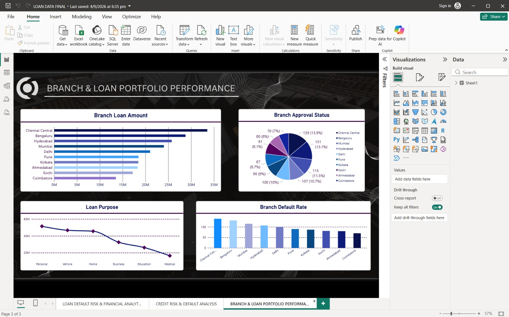

# loan-default-risk-analysis
Interactive Power BI dashboard for analyzing loan applications, credit risk, defaults, branch performance, and loan portfolio trends.
# Loan Default Risk & Financial Analytics

## 📊 Project Overview

This project presents an interactive Power BI dashboard for analyzing loan applications, approval patterns, credit risk, loan defaults, branch performance, and loan portfolio characteristics.

The project uses loan application data and presents the analysis through multiple Power BI dashboard pages.

## 🎯 Objectives

- Analyze loan application and approval patterns
- Analyze loan default risk
- Understand borrower credit risk
- Study the relationship between credit score and loan risk
- Analyze debt-to-income ratio across risk categories
- Compare default patterns across employment categories
- Analyze risk across different loan purposes
- Compare loan performance across branches
- Analyze loan portfolio amounts and approval status

## 🛠️ Tools Used

- Power BI
- Microsoft Excel
- CSV
- Data Cleaning
- Data Analysis
- Data Visualization

## 📊 Dashboard Pages

### 1. Loan Default Risk & Financial Analytics

The main dashboard provides an overview of:

- Total applications
- Approved loans
- Rejected loans
- Total loan amount
- Loan amount by purpose
- Applications by branch
- Risk distribution
- Approval status

### 2. Branch & Loan Portfolio Performance

This page analyzes:

- Branch loan amount
- Branch default rate
- Branch approval status
- Loan portfolio distribution
- Loan amount by purpose

### 3. Credit Risk & Default Analysis

This page analyzes:

- Risk distribution
- Defaults by employment
- Defaults by loan purpose
- Credit score vs risk
- Debt-to-income ratio vs risk

## 📷 Dashboard Screenshots

### Power BI Dashboard 1

### Power BI Dashboard 2

### Power BI Dashboard 3

## 📁 Repository Structure

text
loan-default-risk-analysis/
│
├── Datasets/
│   ├── Loan_data.csv
│   └── Loan_Default_Risk_Analytics.xlsx
│
├── PowerBI/
│   └── LOAN DATA FINAL.pbix
│
├── Screenshots/
│   ├── PowerBI_screenshot_1.jpeg
│   ├── PowerBI_screenshot_2.jpeg
│   ├── PowerBI_screenshot_3.jpeg
│   ├── Approved_loans.png
│   ├── Default_loans.png
│   ├── Default_rate_among_approved_loans.png
│   ├── Risk_segment.png
│   ├── Risk_vs_Credit_Score.png
│   ├── Risk_vs_DTI.png
│   ├── Risk_vs_Employment.png
│   ├── Risk_vs_loan_Purpose.png
│   ├── Total_Application.png
│   └── Total_loan_amount.png
│
└── README.md
